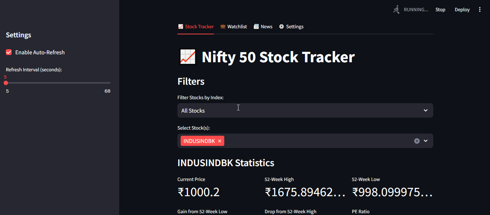
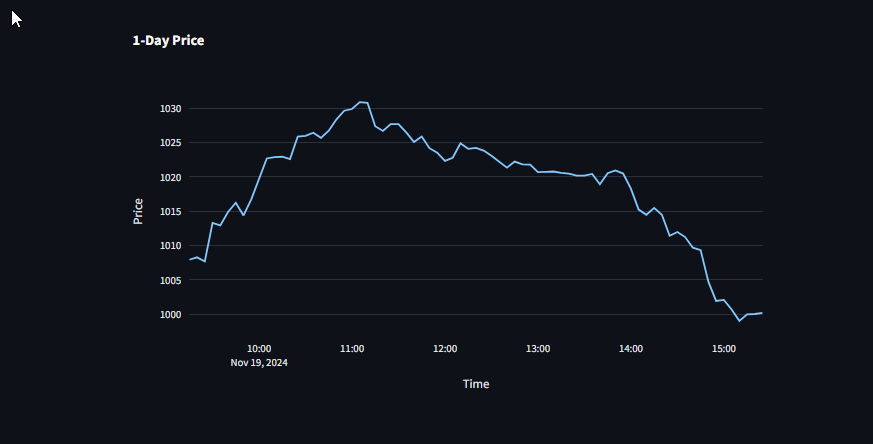
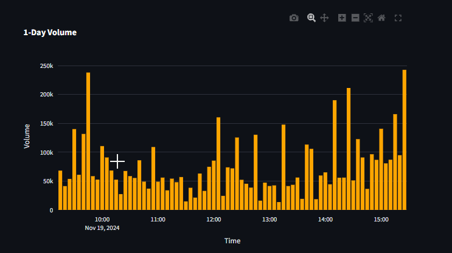

# 📈✨ **Nifty Stock Tracker**  
Your ultimate **real-time stock analytics hub** powered by cutting-edge technologies.
---

## 🚀 **About the Project**
The **Nifty Stock Tracker** is a next-generation, **data-driven web application** built using **Python** and **Streamlit**. It integrates **real-time financial APIs**, **algorithmic analysis**, and **interactive dashboards** to empower users with actionable insights into the stock market.

🔑 **Key Features**:  
- **Real-Time Market Insights** 📊  
  Built on the foundation of **RESTful APIs**, fetching stock data with ultra-low latency.  
- **Advanced Technical Indicators** ⚙️  
  Leverages the power of **technical analysis (TA)** libraries to compute SMA, EMA, RSI, MACD, and Bollinger Bands dynamically.  
- **Watchlist with Persistent Storage** 📋  
  JSON-based data persistence ensures your portfolio and watchlist stay secure across sessions.  
- **API-Driven News Integration** 📰  
  Fetches the latest financial headlines using **News API**, keeping you informed about market movements.  
- **Dynamic Data Visualization** 📉  
  Powered by **Plotly**, enabling highly customizable and interactive charts.  

---

## 🖥️ **Demo Screenshot**

<p align="center">
  
  
  
</p>


---

## 🔧 **Getting Started**

### 1️⃣ Prerequisites  
Ensure you have **Python 3.9+** installed.  

### 2️⃣ Installation  

1. Clone the repository:  
   ```
   git clone https://github.com/<your-username>/nifty-stock-tracker.git
   cd nifty-stock-tracker
   ```

2. Install dependencies:
    ```
    pip install -r requirements.txt
    ```

3. **Add Your News API Key**:
   - Get your API key from [News API](https://newsapi.org).
   - Replace the placeholder `NEWS_API_KEY` in `app.py` with your actual API key.

   
    ```
    NEWS_API_KEY = 'your_news_api_key'
    ```

5. Run the app:
    ```
    streamlit run app.py
    ```

6. Open the app in your browser:
    ```
    http://localhost:8501
    ```

## 📁 Project Structure

    nifty-stock-tracker/
    │
    ├── app.py                 # Main Streamlit app
    ├── portfolio_data.json    # Stores watchlist data
    ├── requirements.txt       # Dependencies list
    ├── README.md              # Documentation
    └── .gitignore             # Ignored files

## 🎨 Core Features in Detail

📊 Real-Time Stock Data
- Low-Latency Data Fetching: Powered by Yahoo Finance API, enabling high-frequency updates.
- Auto-Refreshing Dashboard: Ensures you never miss a price change.
- Data Preprocessing: Implemented using Pandas for handling missing data and optimizing performance.

⚙️ Technical Indicators
- SMA & EMA: Identifies market trends using time-series moving averages.
- MACD & RSI: Implements momentum oscillators to detect overbought or oversold conditions.
- Bollinger Bands: Provides insight into price volatility.
- Scalable Framework: Future-ready for integration with custom indicators and AI/ML models.

📰 News Integration
- RESTful API Consumption: Real-time news integration using JSON-based GET requests.
- Sentiment Analysis Ready: A modular news-fetching system can integrate with NLP libraries like VADER or TextBlob for sentiment analysis.

📉 Interactive Charts
- Dynamic Plotting: Uses Plotly for zoomable and interactive visualizations.
- Intraday and Historical Trends: Enables deep dives into long-term stock patterns and daily fluctuations.

💼 Customizable Watchlist
- Persistent Data Storage: Implemented via JSON, ensuring reliability without database dependencies.
- User-Friendly CRUD Operations: Add, delete, or update stock entries effortlessly.

**Tip**
- If the application keeps refreshing, simply disable the auto-refresh feature in the sidebar or increase the refresh interval. 
- AND the 1D chart won't be visible if the market is **CLOSED** on that particular day

## 📊 Technical Stack

| **Category**         | **Technology**        | **Description**                                      |
|-----------------------|-----------------------|------------------------------------------------------|
| **Frontend**         | Streamlit             | Interactive UI and real-time visualization          |
| **Data**             | yFinance, News API    | Data aggregation and real-time API consumption      |
| **Visualization**    | Plotly                | Rich and interactive charting features              |
| **Analysis**         | Pandas, NumPy, TA-Lib | Data processing and computation of technical indicators |
| **Persistence**      | JSON                  | Lightweight and portable data storage solution      |

## 📦 Dependencies
Install required packages with:
  ```
  pip install -r requirements.txt
  ```

## Included:
- streamlit: Frontend framework for web apps.
- yfinance: Real-time stock data fetching.
- pandas, numpy: Data wrangling and preprocessing.
- plotly: Interactive data visualization.
- ta: Technical analysis indicators.
- requests: RESTful API integration.

## 📈 Future Enhancements

1. AI-Powered Predictions: Integrate machine learning models for stock price forecasting using libraries like TensorFlow or Scikit-Learn.
2. Database Integration: Transition to PostgreSQL for robust watchlist storage.
3. Sentiment Analysis: Automate news sentiment extraction for better market insights.
4. Custom Alerts: Set email/SMS notifications for stock price changes.

## 🛠 Contributing
Want to make it even better? Here's how:

1. Fork the repository
2. Create a feature branch:
    ```
    git checkout -b feature-name
    ```
3. Commit your changes:
    ```
    git commit -m "Added new feature"
    ```
4. Push to your fork:
    ```
    git push origin feature-name
    ```
5. Open a pull request

## 🧑‍💻 Author
Developed with ❤️ by Your Name
📧 Email: v.deepakakash@gmail.com
🌐 Portfolio: coming soon
